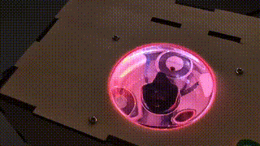

# AudioReactiveControls

This repository contains the source code for controlling ferrofluids and LED light strips for audio visualization on a Raspberry Pi. It includes a Python binding for monitoring audio packets from the PulseAudio system.

<p align="center">
  
</p>

Contributors:
1. Li Siyuan: Hardware setup, ferrofluid and light strip control.
2. Zhao: 3D model design.
3. Weng Haoyang: Audio packet monitoring and software framework.

## Get Started

### Software

Install the `pa_monitor` package by running the following command:

```bash
pip install -e audio_monitor
```

### Hardware

1. **LED Strips**:
    - **Power Pin**: 5V from RPI.
    - **Control Pin s**: Defined in `controller/light_controller.py` (The one corresponding to SPI device 0.)

2. **Electromagnets**:
    - **Driver**: DRV8833.
    - **Power Pin**: 5V from RPI.
    - **Control Pins** and **STANDBY Pins**: Defined in `controller/ferro_controller.py`.

## Usage

Since the GPIO pins need to be accessed by the root user, we implemented a server-client architecture using `zmq` for controlling the peripheral devices (LED strips and electromagnets).

### Running the Server

To run the server, execute the following commands:

```bash
sudo <CONDA_PREFIX>/bin/python controller/light_controller.py
sudo <CONDA_PREFIX>/bin/python controller/ferro_controller.py
```

### Starting the Main Program

To start the main program, execute the following command:

```bash
<CONDA_PREFIX>/bin/python main.py
```

## Known Issues

The pa_monitor implementation will segfault randomly, due to some incorrect implementation regards thread safety.

## Future Directions

1. Add more visualization effects for magnets and LED strips.
2. Now only the kick is detected with librosa onset detection algorithm, we want further use other algorithm to detect more types of beats.
